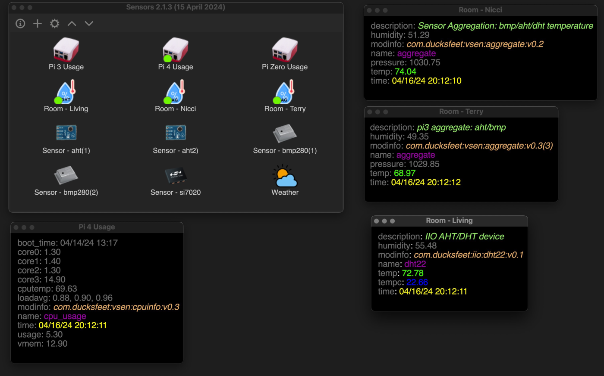

# Sensors
This is a demonstration of using my SensorFS and RestAPI to collect and display data using Gtk 
*Warning* I suck at Python GTK programming! 

## Caveat Emptor
This is demonstration code and not really written for distribution, nor, will it be, this is part of 
a proof of concept for my [SensorFS Proposal](https://github.com/nicciniamh/sensorfs).

I have tested this on my Raspberry Pi4 but mainly run this on macOS Sonoma. This likely will not 
run on your system without teaking paths and creating ramdisks.

## Overview
There are two components: First is get-data.py which forks and runs in background. If the daemon isn't 
started when the main app runs, the daemon is started automatically.

The main program presents a window with icons representing each defined sensors. Buttons on a toolbar 
allow app and sensor configuration. (changes to this will be reflected on the daemon)

Double-clicking an icon brings up a detail window. If there is already a detail window open, that window is raised.

Icons can be sorted by name or type in ascending or descending direction. 

There is a global confugration file, sensors.json, which has both global settings and sensor specfic configuration. 

## SensorFS
[SensorFS](https://github.com/nicciniamh/sensorfs) provides for a single point of data collection and allows for the propagation of data over networks. In this case, a simple RESTful API is useed. Requests are made over http, data is returned as JSON object. 

## Collecing Data
Because of the Python Global Interpreter Lock, or GIL, true concurrent threads are not possible, thus, 
when the requests module takes a long time due to network issues, the whole works gets locked up. By using a separate daemon, the UI is snappy and the daemon can deal with timeouts, missing hosts, or any other errors.

In the global configuration dictionary has a member, senssors, which has settings for each sensor. On each iteration of the daemon, each sensor is read via REST, and their data is stored on data_path. This should be a ram disk to prevent storage fatigue.

Aside from each configured sensors, from the global config, daemon uses the poll_interval setting to determine sleep between iterations, and the server setting to determine the api server. This allows the changes from the GUI to be reflected by the daemon.
 

## Installation
Well, this is the fun bit isn't it. 

Frist, clone this repository into where it will run. You will need to copy or rename sensors.json.dist to sensors.json. 

Since this was made for my mac with a ramdisk on /Volumes/RamDisk and data stored on /Volumes/RamDisk/sensordata. To change this location get-data.py must be edited and sendetail must be edited to relect the place to store and read data. 

The daemon writes data anywhere from 200ms to 2000ms. This can fatique solid state media and really should be done on a ramdisk. 

This program is meant to run from it's own directory. See prog_dir in sensors.py and get-data.py. 

